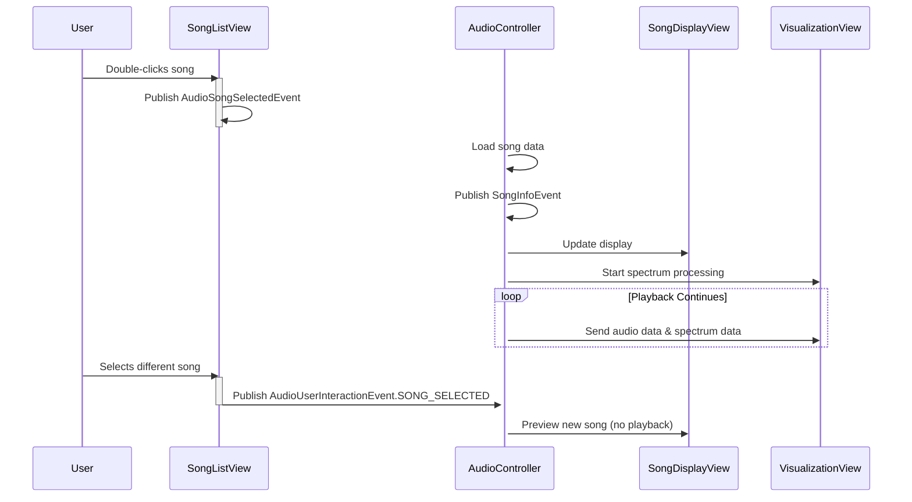

# 🎵 Tunes4J Architecture Plan - Reactive MVC Music Player

## 📖 Overview

Tunes4J implements a **reactive MVC architecture** based on Domain-Driven Design (DDD) principles. The system is composed of independent, **event-driven MVC components** that communicate through the **Observer Pattern**. This design achieves **loose coupling** while enabling **reactive, real-time updates** across the entire application.

**🔥 KEY REFACTORING REQUIREMENT**: Each MVC Component (Bounded Context) **MUST** copy its corresponding GUI components from `/gui/` and **enhance them** to implement reactive, event-driven architecture using the Observer Pattern. GUI components are **NOT** optional - they are **core to the MVC pattern** and essential for bounded context independence.

**Migration Strategy**: **COPY FIRST** → GUI components are duplicated from `/gui/` directory to respective bounded context `/view/` directories, then **ENHANCED** with:
- `@EventListener` annotations for reactive event handling
- `ApplicationEventPublisher` injection for Observer Pattern communication
- Removal of direct component coupling
- Event-driven updates instead of direct method calls

## 🏗️ Architectural Foundations

### **Core Design Patterns**

#### **1. Observer Pattern - The Communication Backbone**

The Observer Pattern is the fundamental communication mechanism between all components:

```
Subject (Observable)         Observer (Listener)
├── Component 1             ├── Component A
├── Component 2             ├── Component B
└── Events                  ├── Component C

   Publishes Events -------------> Receives Events
   (Domain Events)                (@EventListener)
```

**Key Characteristics:**
- **Subject**: Any component that publishes events (`ApplicationEventPublisher`)
- **Observer**: Any component that listens for events (`@EventListener`)
- **Event**: Immutable message containing context data
- **Reactive Flow**: Events flow from producers to consumers automatically

#### **2. Reactive MVC Pattern - Component Structure**

Each MVC component follows a reactive pattern:

```
[MVC Component]
├── Model: Domain Objects & Business Logic
├── View: Reactive UI Components (@EventListener)
├── Controller: Event Processing & Publishing
└── Events: Observer Pattern Communication

Reactive Flow: View → Events → Controller → Events → View/Model
```

### **3. Event System Architecture - The Reactive Nervous System**

#### **Event Publishing Pattern**

```java
@Component
public class SongListView extends BaseController {  // BaseController has ApplicationEventPublisher

    @Autowired
    private ApplicationEventPublisher eventPublisher;  // Injected by Spring

    public void handleUserAction(Song song) {
        // Direct method call
        eventPublisher.publishEvent(
            new AudioSongSelectedEvent(song, this)
        );
    }
}
```

#### **Event Listening Pattern**

```java
@Component
public class AudioController extends BaseController {

    @EventListener  // Spring automatically registers this method
    public void handleSongActivation(AudioSongSelectedEvent event) {
        // Reactor pattern: Event triggers state change
        startPlayback(event.getSelectedSong());
    }
}
```

### **4. Component Lifecycle & Observer Management**

**Registration/De-registration Pattern:**
```java
@Component
public class SongDisplayView {

    @Autowired
    private ApplicationEventPublisher publisher;

    @PostConstruct  // Observer pattern registration
    public void registerAsObserver() {
        // Component becomes observer on startup
    }

    @PreDestroy  // Observer pattern cleanup
    public void unregisterAsObserver() {
        // Clean up event subscriptions
    }
}
```

### **5. Observer Relationship Mapping - The Reactive Social Network**

```
[Producer]                  → [Consumers]
SongListView                 → AudioController, SongDisplayView
├── Single-Click            → SongInfoEvent listeners
├── Double-Click            → AudioSongSelectedEvent listeners
└── Cell Edit               → TableModel listeners

AudioController             → SongDisplayView, VisualizationView
├── Playback Started       → AudioDataEvent listeners
├── Playback Paused        → AudioStateEvent listeners
├── Volume Changed         → ThemeManager, UIComponents
└── Track Changed          → SongInfoEvent listeners

ThemeManager               → ALL UI Components
└── Theme Switched         → ThemeChangedEvent listeners
```

## 🏗️ Bounded Context Architecture (DDD Principles)

### **Domain-Driven Design Structure**

Each domain is a **complete bounded context** containing:
- **Model Layer**: Entities, Value Objects, Business Logic (DDD Domain)
- **Controller Layer**: Reactive UI Coordinators & Event Handlers (MVC + DDD Application)
- **Service Layer**: Business Logic Orchestrators & Use Cases (DDD Application Services)
- **Adapter Layer**: External Services, Ports & Adapters (NO REPOSITORIES IN AUDIO!)
- **View Layer**: UI Components, Reactive Event Handlers

```
[Audio Bounded Context]           [Playlist Bounded Context]           [Library Bounded Context]
├── audio/model/                ├── playlist/model/               ├── library/model/
│   ├── Song.java               │   ├── Playlist.java             │   ├── LibrarySong.java
│   └── AudioPlayback.java      │   ├── PlaylistSong.java         │   ├── Metadata.java
├── audio/controller/           ├── playlist/controller/          ├── library/adapter/
│   └── AudioController.java    │   └── PlaylistController.java   │   ├── SongRepository.java
├── audio/service/              ├── playlist/service/             │   └── MetadataRepository.java
│   ├── PlaybackService.java    │   ├── PlaylistService.java       ├── library/service/
│   └── SpectrumService.java    │   └── PlaylistManagement.java    │   ├── SongPersistenceService.java
├── audio/adapter/              ├── playlist/adapter/             │   └── MetadataIndexingService.java
│   └── AudioPlayerAdapter.java │   ├── PlaylistRepositoryImpl.java
│   (external APIs only)        │   └── PlaylistDragDropAdapter.java
├── audio/view/                 └── playlist/view/
│   ├── SongListView.java           ├── PlaylistView.java
│   ├── AudioPlayerView.java       ├── PlaylistEditor.java
│   └── SongDisplayView.java       └── PlaylistManager.java
```

### **🚨 KEY ARCHITECTURE CORRECTION:**

**Audio Bounded Context**: **PLAYBACK ONLY** - NOT persistence!
- ✅ Responsible for: Audio playback, visualization, controls, DSP
- ❌ **NOT Responsible**: Song persistence, library management
- 🔗 **Depends on**: Library bounded context domain services
- 🎯 **Single Responsibility**: Audio operations (MVC pattern)

**Library Bounded Context**: **SONG MANAGEMENT ONLY**
- ✅ Responsible for: Song persistence, metadata, file management, search/indexing
- ❌ **NOT Responsible**: Audio playback operations
- 📖 **Provides**: Domain services for song data management
- 🎯 **Single Responsibility**: Library curation (DDD Repository pattern)

**Key DDD Principle:**
- **Domain Models** = Pure Business Logic (No JPA annotations, no technical concerns)
- **DTOs/Entities** = Persistence Objects (Contain @Entity, @Data, technical persistence details)
- **Repositories** = Domain Interface (Infrastructure adapters implement them)

### **Current DDD-Compliant Structure:**
```
[Audio Bounded Context]           [Application Bounded Context]
├── audio/model/                ├── application/view/
│   ├── AudioPlayback.java      ├── ApplicationView.java
│   └── AudioDomainObjects      ├── ApplicationMenuBar.java
├── audio/controller/           ├── application/controller/
│   └── AudioController.java    └── ApplicationController.java
├── audio/service/              [DTO/Infrastructure Layer]
│   ├── PlaybackService.java    ├── dto/
│   └── SpectrumService.java    │   ├── Song.java (@Entity)
│   └── audio/adapter/          │   ├── PlayList.java (@Entity)
│       ├── JpaSongRepository   │   └── Column.java (@Entity)
│       ├── AudioPlayerAdapter
│       └── SpectrumAdapter
└── audio/view/
    ├── SongListView.java
    ├── AudioPlayerView.java
    └── SongDisplayView.java
```

### 🎼 **Audio Bounded Context Core Components**
**Context**: Music playback, visualization, and audio control
**Source GUI Components**: `PlayerPanel.java`, `SongDisplayPanel.java`, `MediaTable.java`, `JPanelSpectrum.java`, `JPanelSoundWave.java`, `SpectrumProcessor.java`

### 🎼 **1. Model Layer** (`audio/model/`)
- **Song Entity**: Core domain object with business rules (migrated from `dto/Song.java`)
- **Album Entity**: Song collection with metadata validation
- **AudioPlayback Aggregate**: Playback state and control rules
- **Spectrum Domain Objects**: Frequency analysis business logic

### 🎼 **2. Controller Layer** (`audio/controller/`)
- **AudioController**: Reactive UI coordinator - handles reactive events from views, coordinates with services
- **Event Handlers**: `@EventListener` for `AudioSongSelectedEvent`, `AudioUserInteractionEvent`, `AudioPlaybackStateEvent`

### 🎼 **3. Service Layer** (`audio/service/`)
- **PlaybackService**: Business logic orchestrator for audio playback operations (migrated from `player/Tunes4JAudioPlayer.java`)
- **SpectrumService**: Business logic orchestrator for spectrum processing & visualization (FFT logic from `dsp/`)

### 🎼 **4. Adapter Layer** (`audio/adapter/`)
- **SongRepositoryImpl**: JPA implementation of domain repository (migrated from `dao/SongRepository.java`)
- **AudioPlayerAdapter**: External audio library adapter (Port/Adapter)
- **SpectrumAdapter**: FFT processing adapter wrapper (KJFFT from `dsp/`)

### 🎼 **5. View Layer - GUI Components Migration** (`audio/view/`)
**Migration Source**: `gui/PlayerPanel.java`, `gui/SongDisplayPanel.java`, `gui/MediaTable.java`, `gui/JPanelSpectrum.java`, `gui/JPanelSoundWave.java`

- **SongListView**: Reactive UI component (`MediaTable.java`) - song selection and display (@EventListener)
- **AudioPlayerView**: Playback controls (`PlayerPanel.java`) - play/pause/stop/volume controls (event publisher)
- **SongDisplayView**: Current song information panel (`SongDisplayPanel.java`) - displays metadata (@EventListener)
- **SpectrumView**: Audio visualization (`JPanelSpectrum.java`, `JPanelSoundWave.java`) - real-time spectrum display (@EventListener)
- **AudioSpectrumView**: Spectrum processing coordinator (`SpectrumProcessor.java`) - manages visualization lifecycle

### 🎵 **Playlist Bounded Context Core Components**
**Context**: Playlist management, organization, and navigation
**Location**: `playlist/` (Independent bounded context)
**Source GUI Components**: `sourcelist/SourceList.java`, `sourcelist/SourceListModel.java`, `LeftPanel.java`, shared `MediaTable.java`

#### **1. Model Layer** (`playlist/model/`)
- **Playlist Aggregate**: Root entity with business rules (migrated from `dto/PlayList.java`)
- **PlaylistSong Entity**: Many-to-many relationship validation
- **PlaylistCategory**: Folder-like organization structure (from `SourceListCategory.java`)

#### **2. Controller Layer** (`playlist/controller/`)
- **PlaylistController**: Reactive UI coordinator - handles playlist-related events and user interactions
- **Event Handlers**: `@EventListener` for playlist selection, creation, deletion events

#### **3. Service Layer** (`playlist/service/`)
- **PlaylistService**: Business logic orchestrator for playlist management operations
- **PlaylistManagement**: Complex playlist business rules and workflows (drag-drop logic from `LibraryToPlaylistTransferHandler.java`)

#### **4. Adapter Layer** (`playlist/adapter/`)
- **PlaylistRepositoryImpl**: JPA implementation of playlist persistence (migrated from `dao/PlayListRepository.java`)
- **PlaylistDragDropAdapter**: Drag-and-drop interaction adapter (migrated from `gui/LibraryToPlaylistTransferHandler.java`)
- **PlaylistViewAdapter**: UI integration and data binding adapter

#### **5. View Layer - GUI Components Migration** (`playlist/view/`)
**Migration Source**: `gui/sourcelist/`, `gui/LeftPanel.java`, shared `gui/MediaTable.java`

- **PlaylistView**: Main playlist navigation panel (`LeftPanel.java`) - displays playlist tree (@EventListener & event publisher)
- **PlaylistSourceListView**: Hierarchical playlist/source view (`SourceList.java`) - renders playlist categories and lists (@EventListener)
- **PlaylistEditorView**: Playlist creation/editing dialog - manages playlist metadata (@EventListener & event publisher)
- **PlaylistManager**: Playlist operation controls - add/remove/reorder songs (@EventListener & event publisher)

### 📚 **3. Library Bounded Context** (Cross-cutting Domain)
**Context**: Song library management and metadata
**Location**: `library/` (Shared infrastructure)

#### **Model Layer** (`library/model/`)
- **Library Aggregate**: Song collection with search/filter rules
- **Metadata Aggregate**: ID3 tags, filesystem metadata

#### **Adapter Layer** (`library/adapter/`)
- **LibraryRepositoryImpl**: Song database persistence
- **MetadataExtractor**: External library adapter
- **FileWatcher**: Filesystem monitoring adapter

### **Spectrum Integration**
- **SpectrumService**: Orchestrates FFT processing and visualization coordination
- **Direct Coordination**: AudioController directly manages SpectrumProcessor
- **Unified Lifecycle**: SpectrumProcessor activated/deactivated with playback
- **No Event Mediation**: Spectrum updates handled via method calls, not events
- **Co-located Code**: All audio + spectrum functionality in `audio/` package for tight coupling

### 🖥️ **Application Bounded Context Core Components**
**Context**: UI composition, layout management, and cross-domain coordination
**Location**: `application/` (Composition root)
**Source GUI Components**: `ApplicationWindow.java`, `ApplicationMenuBar.java`, `LeftSplitPane.java`, `SplitPane.java`

#### **1. View Layer - GUI Components Migration** (`application/view/`)
**Migration Source**: `gui/ApplicationWindow.java`, `gui/ApplicationMenuBar.java`, `gui/LeftSplitPane.java`

- **ApplicationWindow**: Main application frame and layout (`ApplicationWindow.java`) - composes bounded context views (@EventListener)
- **MainSplitPane**: Split panel layout manager (`LeftSplitPane.java`, `SplitPane.java`) - manages audio/playlist pane division

#### **2. Controller Layer** (`application/controller/`)
- **ApplicationController**: Global state management and coordination - manages cross-context event routing
- **Integration Patterns**: Context mapping, anti-corruption layer interfaces

#### **Integration Patterns**
- **Context Mapping**: Defines relationships between bounded contexts
- **Anti-Corruption Layer**: Translates between domain models if needed
- **Shared Kernel**: Common UI components (fonts, themes), shared infrastructure

## 🔄 Detailed Reactive Event Flow Diagrams

### **Primary User Interaction Chain**



### **Event Flow Matrix**

| Trigger | Source Component | Event Published | Consumers | Action |
|---------|------------------|-----------------|-----------|--------|
| **Double-Click** | SongListView | `AudioSongSelectedEvent` | AudioController | Start/stop playback |
| | | | SongDisplayView | Update current song info |
| | | | VisualizationView | Start spectrum animation |
| **Single-Click** | SongListView | `AudioUserInteractionEvent.SONG_SELECTED` | AudioController | Load song preview |
| | | | SongDisplayView | Highlight selected row |
| **Playback State** | AudioController | `AudioPlaybackStateEvent` | All UI Components | Update play/pause/stop icons |
| **Song Data** | AudioController | `SongInfoEvent` | SongDisplayView | Update artwork/details |
| | | | Playlist Components | Update active indicator |
| **Theme Change** | ThemeManager | `ThemeChangedEvent` | All UI Components | Refresh colors/fonts |
| **Spectrum Data** | AudioController | `AudioDataEvent` | VisualizationView | Render frequency bars |

### **Implementation Patterns**

#### **1. Domain Event Pattern**
```java
// Immutable event with domain context
public class AudioSongSelectedEvent extends AudioDomainEvent {
    private final Song selectedSong;

    public AudioSongSelectedEvent(Song selectedSong, Object source) {
        super();
        this.selectedSong = Objects.requireNonNull(selectedSong);
        // No mutable fields - immutable by design
    }
}
```

#### **2. Event Listener Pattern (Reactive Chain)**
```java
@Component
public class AudioController {

    @EventListener  // Subscribes to multiple event types
    public void onSongActivation(AudioSongSelectedEvent event) {
        startPlayback(event.getSelectedSong());
        publishAudioStateChange(PLAYING);
    }

    @EventListener
    public void onUserInteraction(AudioUserInteractionEvent event) {
        switch(event.getAction()) {
            case PLAY_CLICKED -> handlePlay();
            case VOLUME_CHANGED -> updateVolume(event.getData());
        }
    }
}
```

#### **3. BaseController Pattern**
```java
public abstract class BaseController {
    @Autowired protected ApplicationEventPublisher publisher;

    protected void publishEvent(ApplicationEvent event) {
        System.out.println("📢 EVENT: " + event.getClass().getSimpleName());
        publisher.publishEvent(event);
    }
}
```

### **Benefits & Performance**

#### **Observer Pattern Benefits**
- **Zero Coupling**: Components know nothing about each other
- **Plug-and-Play**: Add/remove components without recompilation
- **Broadcast Communication**: One-to-many event distribution
- **Cross-Cutting Concerns**: Themes, logging, monitoring through events
- **Testability**: Mock event publishers/consumers independently

#### **Reactive Architecture Advantages**
- **Immediate UI Updates**: No polling, events trigger instant updates
- **Decoupled Architecture**: Business logic separated from presentation
- **Scalable Communication**: Easy to add features without changing existing code
- **Debuggable Events**: Rich logging of component interactions
- **Real-time Feedback**: User actions immediately reflected in UI

#### **Performance Optimizations**
- **Lazy Event Processing**: `@Async` for non-critical event handlers
- **Filtered Listeners**: Categories reduce unnecessary processing
- **Event Pooling**: Reuse common event objects to minimize GC
- **Debounced Updates**: Prevent UI spam during rapid changes

## 📦 DDD Context Boundaries - Anti-Corruption Layers

### **Context Mapping Strategy**
```
[Audio Bounded Context]    ←→   [Playlist Bounded Context]
     ↑                                       ↑
     └───────────── ACL ──────────┘ (Anti-Corruption Layer)
           ↓
[Library Bounded Context]  ←→  [Application Bounded Context]
```

### **Domain Relationships**
- **Audio ← Library**: Shared Song entity (DDD Shared Kernel)
- **Audio → Playlist**: Song references via PlaylistSong entity
- **Audio ⇄ Application**: Event-based loose coupling
- **Playlist ⇄ Application**: UI integration via reactive events

### **Anti-Corruption Layer (ACL) Contracts**
```java
// Shared Kernel - Common Song Domain Model
interface SongDomainModel {
    String getTitle();
    String getArtist();
    Duration getDuration();
    // ... shared business rules
}

// ACL Translator Pattern
public class AudioToPlaylistSongTranslator {
    public static AudioSong toAudioSong(PlaylistSong playlistSong) {
        return AudioSong.builder()
            .title(playlistSong.getSongTitle())
            .artist(playlistSong.getSongArtist())
            // ... translation logic
            .build();
    }
}
```

### **Repository Interface Segregation**
```java
// Audio Context Repository Interface
interface AudioSongRepository {
    AudioSong findById(AudioSongId id);
    List<AudioSong> findAll();
    AudioSong save(AudioSong song);
}

// Playlist Context Repository Interface
interface PlaylistRepository {
    Playlist findById(PlaylistId id);
    PlaylistSong save(PlaylistSong playlistSong);
}

// Infrastructure Implementation
@Repository
public class JpaAudioSongRepository implements AudioSongRepository {
    // Audio context specific persistence logic
}

@Repository
public class JpaPlaylistRepository implements PlaylistRepository {
    // Playlist context specific persistence logic
}
